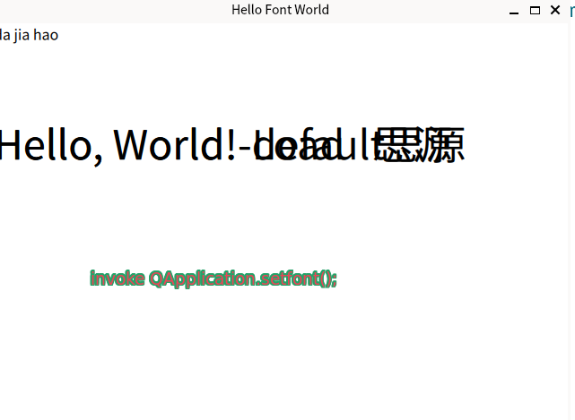

# apply customer font in Qt6
- eton@241224 init the demo for font in qt;
- eton@241231 add HtmlDocumentItem for demonstrate the `QTextDocument`;

## Contents
if the font file in system wide path, then direct set is valid, otherwise follow steps:
1. add font file(ttf/otf) to qt resources system, make it available to app;
2. `QFontDatabase::addApplicationFont(":/fonts/komika_font.ttf");` add to qt font DB; //this make font load available;

3. load font `QFont font = QFont("Komika Axis", 10, 1);`;

4. `app.setFont(font);`;

5. done;

## Env:
- qt6.5;
- debian12;
## Results

- 
- 

## Refs:
ref:[Embedding Fonts in Your Qt Application](https://amin-ahmadi.com/2016/01/07/embedding-fonts-in-your-qt-app/)
